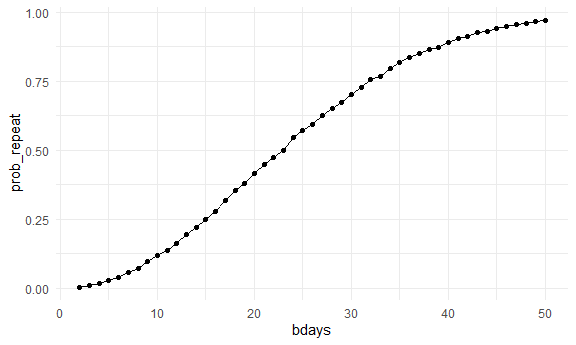
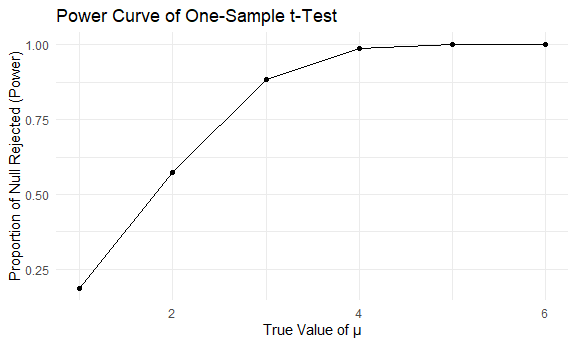
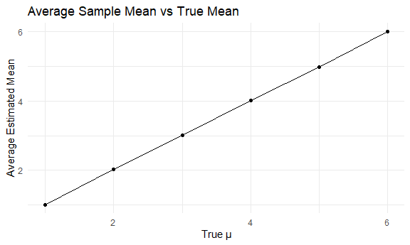
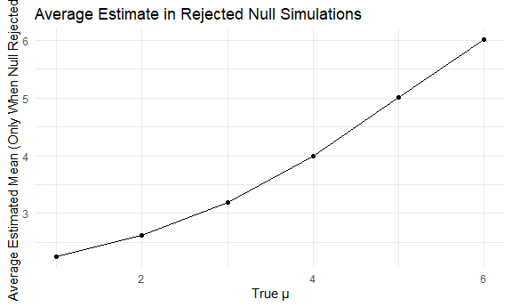
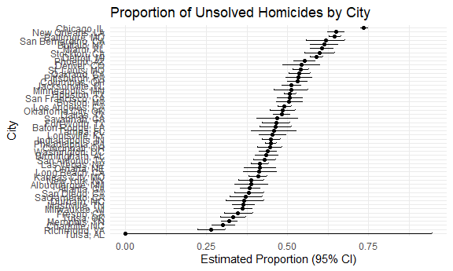

p8105_hw5_csl2209
================
Casandra Laney
2025-11-14

## Problem 1

Make a function

``` r
bday_sim = function(n_room) {
  
  birthdays = sample(1:365, n_room, replace = TRUE)

  repeated_bday = length(unique(birthdays)) < n_room

  repeated_bday
}
```

check it works

``` r
bday_sim(5)
```

    ## [1] FALSE

Run function 10000 times for each group size between 2 and 50

``` r
bday_sim_results =
  expand_grid(
    bdays = 2:50,
    iter = 1:10000
  ) |>
  mutate(
    result = map_lgl(bdays, bday_sim)
  ) |>
  group_by(
    bdays
  ) |>
  summarize(
    prob_repeat = mean(result)
  )
```

Make a plot

``` r
bday_sim_results |>
  ggplot(aes(x = bdays, y = prob_repeat)) +
  geom_point() +
  geom_line()
```



Comment on your results:

## Problem 2

Write the function

``` r
one_samp_t_sim = function(mu_hat) {
  
  one_samp = rnorm(30, mean = mu_hat, 5)
  
  one_samp_test = t.test(one_samp, mu = 0)
  
  broom::tidy(one_samp_test)
}
```

test it

``` r
one_samp_t_sim(5)
```

    ## # A tibble: 1 × 8
    ##   estimate statistic     p.value parameter conf.low conf.high method alternative
    ##      <dbl>     <dbl>       <dbl>     <dbl>    <dbl>     <dbl> <chr>  <chr>      
    ## 1     4.52      6.98 0.000000114        29     3.20      5.84 One S… two.sided

Run function 5000 times for each group size between 1 and 6

``` r
one_samp_sim_results =
  expand_grid(
    mu_values = 1:6,
    iter = 1:5000
  ) |>
  rowwise() |>
  mutate(
    result = map(mu_values, one_samp_t_sim)
  ) |>
  unnest(result)
```

Make a plot showing the proportion of time null was rejected

``` r
one_samp_sim_results |>
  group_by(mu_values) |>
  summarize(power = mean(p.value < 0.05)) |>
  ggplot(aes(x = mu_values, y = power)) +
  geom_line() +
  geom_point() +
  labs(
    title = "Power Curve of One-Sample t-Test",
    x = "True Value of μ",
    y = "Proportion of Null Rejected (Power)"
  )
```



Plot of avg estimate vs true value

``` r
one_samp_sim_results |>
  group_by(mu_values) |>
  summarize(avg_estimate = mean(estimate)) |>
  ggplot(aes(x = mu_values, y = avg_estimate)) +
  geom_point() +
  geom_line() +
  labs(
    title = "Average Sample Mean vs True Mean",
    x = "True μ",
    y = "Average Estimated Mean"
  )
```



Plot of avg estimate in rejected nulls

``` r
one_samp_sim_results |>
  filter(p.value < 0.05) |> 
  group_by(mu_values) |>
  summarize(avg_rejected = mean(estimate)) |>
  ggplot(aes(x = mu_values, y = avg_rejected)) +
  geom_point() +
  geom_line() +
  labs(
    title = "Average Estimate in Rejected Null Simulations",
    x = "True μ",
    y = "Average Estimated Mean (Only When Null Rejected)"
  )
```



## Problem 3

``` r
homicide_data = read_csv("data/homicide-data.csv")
```

    ## Rows: 52179 Columns: 12
    ## ── Column specification ────────────────────────────────────────────────────────
    ## Delimiter: ","
    ## chr (9): uid, victim_last, victim_first, victim_race, victim_age, victim_sex...
    ## dbl (3): reported_date, lat, lon
    ## 
    ## ℹ Use `spec()` to retrieve the full column specification for this data.
    ## ℹ Specify the column types or set `show_col_types = FALSE` to quiet this message.

The dataset ‘homicide-data’ contains 12 variables of criminal homicide
data collected in 50 of the largest American cities.

Important variables include:

- ‘reported_date’: the date the case was reported

- ‘victim_last’: the last name of the victim

- ‘victim_first’: the first name of the victim

- ‘victim_race’: the race of the victim

- ‘victim_age’: the age of the victim

Summarize within cities to obtain the total number of homicides and the
number of unsolved homicides

``` r
city_homicides = 
  homicide_data |>
  mutate(
    city_state = str_c(city, state, sep = ", ")) |>
  group_by(city_state) |>
  summarize(
    total_homicides = n(),
    unsolved_homicides = 
      sum(disposition %in% c("Closed without arrest", "Open/No arrest"))
  ) 

city_homicides
```

    ## # A tibble: 51 × 3
    ##    city_state      total_homicides unsolved_homicides
    ##    <chr>                     <int>              <int>
    ##  1 Albuquerque, NM             378                146
    ##  2 Atlanta, GA                 973                373
    ##  3 Baltimore, MD              2827               1825
    ##  4 Baton Rouge, LA             424                196
    ##  5 Birmingham, AL              800                347
    ##  6 Boston, MA                  614                310
    ##  7 Buffalo, NY                 521                319
    ##  8 Charlotte, NC               687                206
    ##  9 Chicago, IL                5535               4073
    ## 10 Cincinnati, OH              694                309
    ## # ℹ 41 more rows

Use the prop.test function to estimate proportion of homicides for
Baltimore

``` r
baltimore = 
  city_homicides |>
  filter(city_state == "Baltimore, MD")

prop.test(
  x = baltimore$unsolved_homicides,
  n = baltimore$total_homicides
) |> 
  broom::tidy()
```

    ## # A tibble: 1 × 8
    ##   estimate statistic  p.value parameter conf.low conf.high method    alternative
    ##      <dbl>     <dbl>    <dbl>     <int>    <dbl>     <dbl> <chr>     <chr>      
    ## 1    0.646      239. 6.46e-54         1    0.628     0.663 1-sample… two.sided

``` r
baltimore
```

    ## # A tibble: 1 × 3
    ##   city_state    total_homicides unsolved_homicides
    ##   <chr>                   <int>              <int>
    ## 1 Baltimore, MD            2827               1825

Run prop.test for each city

``` r
city_prop_tests =
  city_homicides |>
  mutate(
    prop_test = 
      map2(unsolved_homicides, total_homicides, \(x, n) prop.test(x, n)
    ),
    tidied = map(prop_test, broom::tidy)
  ) |>
  select(city_state, tidied) |>
  unnest(tidied)
```

    ## Warning: There was 1 warning in `mutate()`.
    ## ℹ In argument: `prop_test = map2(...)`.
    ## Caused by warning in `prop.test()`:
    ## ! Chi-squared approximation may be incorrect

Plot of estimates & CIs for each city

``` r
city_prop_tests |>
  mutate(city_state = fct_reorder(city_state, estimate)) |>
  ggplot(aes(x = city_state, y = estimate)) +
  geom_point() +
  geom_errorbar(aes(ymin = conf.low, ymax = conf.high), width = 0.2) +
  coord_flip() +
  labs(
    title = "Proportion of Unsolved Homicides by City",
    x = "City",
    y = "Estimated Proportion (95% CI)"
  )
```


